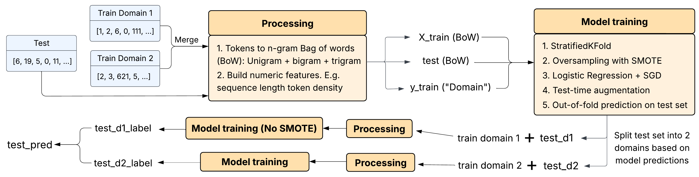

# COMP90051-A2
Text Generation Detection and Classification

`train.ipynb` is the baseline method that I used, merge training sets from domain 1 and domain 2 and make simple prediction.

`multitask-tta-v2.ipynb` is the final method, includes varient of Multi-task learning, generate n-grams of the given indices list,
add few more numeric features of the texts (tested to have positive affect on the model performance), adapted out-of-folds 
validation technique, use SMOTE and test-time augmentation (TTA) to deal with imbalanced dataset. TTA is used to boost the model
performance. A demo workflow is given below.

